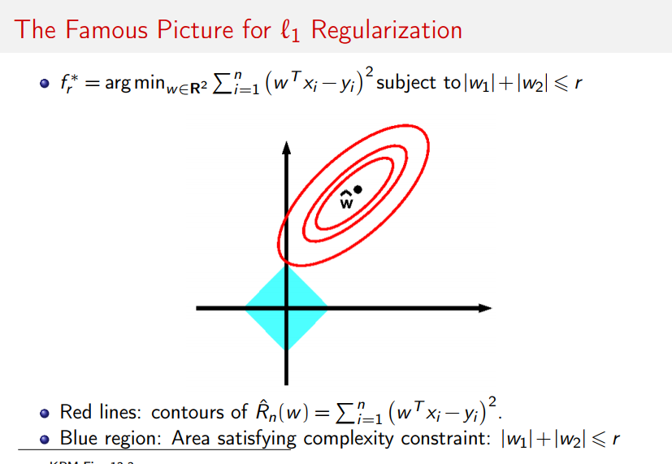
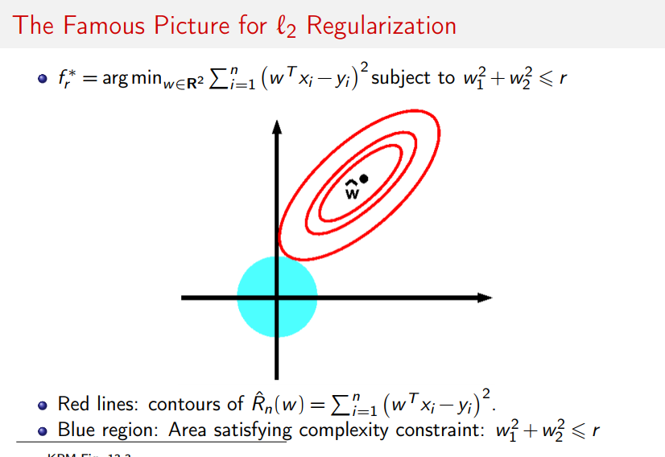

# Common Data science interview questions and answers

### What is regularization? The differences between Lasso vs Ridge?
- Regulization is a process of adding a tuning parameter to a model to induce smoothness of the weights (prevent the coefficients to fit so perfectly) in order to prevent overfitting.
- Lasso formula:  
 
  

Ridge formula:  
   
Lasso vs. Ridge comparison:  
  
   

Check out this wonderful post: [Differences between L1 and L2 as Loss Function and Regularization](http://www.chioka.in/differences-between-l1-and-l2-as-loss-function-and-regularization/)  

### What is Marketing Mix Model (MMM)?
